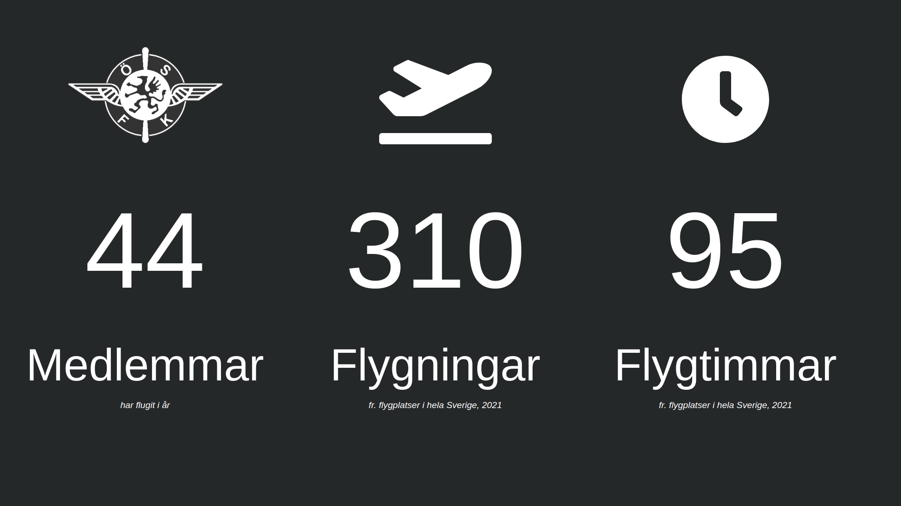

# Myweblog flightclub statistics

# Install
Set the environment variables needed by the `main.js` server.
```
export MYWEBLOG_SYSTEM_USER=xxx-xxxx
export MYWEBLOG_SYSTEM_PASSWORD=xxxxxxxxxxxx

npm install
cd my-app
npm install
```

# Run
```
node main.js
cd my-app
npm start
```
Dashboard should be visible on `localhost:3000`

# Preview

